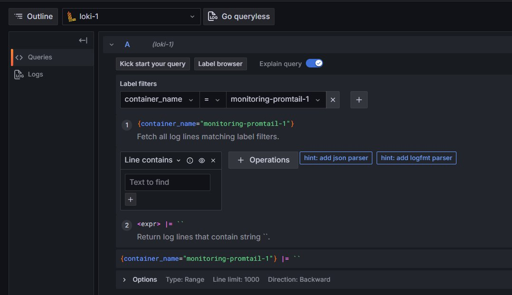
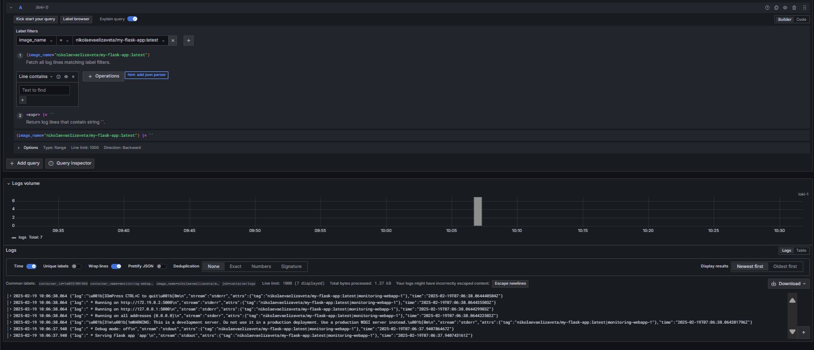

# Logging Stack Documentation

## Overview

This document explains how the logging stack functions setup. The stack is composed of four primary components: the web application (`webapp`), Loki, Promtail, and Grafana. These tools collect, store, and visualize logs for monitoring and troubleshooting purposes.

## Components

### Web Application (webapp)

- **Image**: `nikolaevaelizaveta/my-flask-app:latest`
- **Port Mapping**: Exposed on `4000:80`
- **Role**: This service runs the primary web application (a Flask-based app) that generates logs. The logs are captured using Docker's `json-file` logging driver, following the configured template.

### Loki

- **Image**: `grafana/loki:2.9.2`
- **Port**: `3100`
- **Role**: Loki is a log aggregation system optimized for storing and querying logs. It receives log entries from Promtail and efficiently stores them without full-text indexing, which helps in maintaining performance during queries.

### Promtail

- **Image**: `grafana/promtail:2.9.2`
- **Mounted Volumes**:
  - The Promtail configuration file (`promtail-config.yaml`) is mounted into the container.
  - Docker container log directories (e.g., `/var/lib/docker/containers`) are also mounted.
- **Role**: Promtail is the agent that scans log files generated by Docker containers. It processes these logs through a series of pipeline stages (e.g., JSON parsing, regex filtering, timestamp extraction, and labeling) before forwarding them to Loki.

### Grafana

- **Image**: `grafana/grafana:latest`
- **Port**: Exposed on `3001:3000`
- **Role**: Grafana provides a web interface for visualizing the logs stored in Loki. An inline provisioning script (in the container's entrypoint) automatically sets up a Loki data source. This allows to create dashboards and panels to monitor and analyze log data easily.

## How the Logging Stack Works

1. **Log Generation**: The `webapp` service generates logs that are captured by Docker's logging driver.
2. **Log Collection**: Promtail monitors Docker’s log directories, parses and labels the logs according to the configuration defined in `promtail-config.yaml`, then pushes the processed logs to Loki at `http://loki:3100/loki/api/v1/push`.
3. **Log Storage**: Loki receives and stores these logs efficiently, making them available for querying.
4. **Log Visualization**: Grafana connects to Loki (the data source is provisioned automatically) and allows you to build dashboards. These dashboards display query results, enabling real-time monitoring and troubleshooting.

## Screenshots

- **Web App Container Running**:  
  
  

- **Grafana**:  
  
  

- **Loki**:  
  
  

- **Promtail**:  
  
  

- **Logs**:  
  
  
  
  

## Conclusion

This setup facilitates straightforward log collection, efficient storage, and intuitive visualization, which are essential for real-time monitoring and troubleshooting.